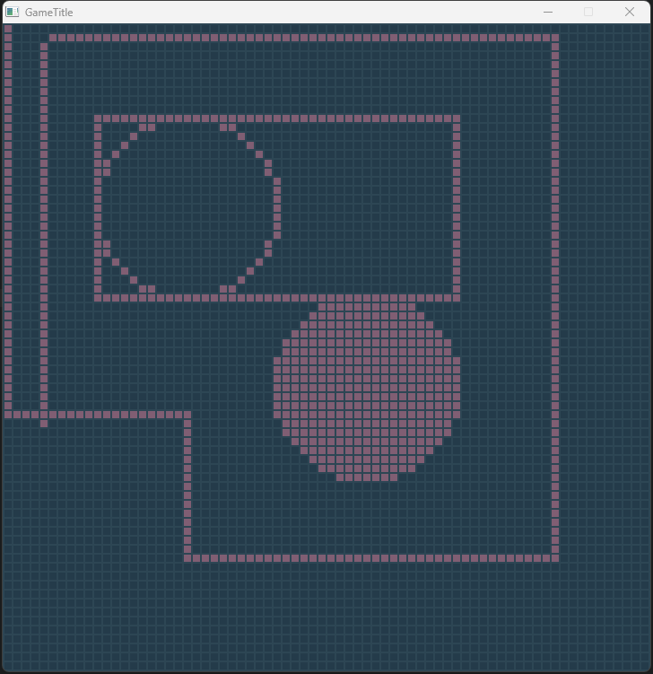

# This project is a easy, simple maybe even a little buggy game framework

## Warning: this project is currently not finished! and having some memry leaking(?) issue.
---

this project is aim to build a game framework that works like pico8,
which you only need to write code in GameplayCore.c file.
and there're two special call back function, birth() which works exactly like init() or beginplay() in other game engine/framework. and pulse() works exactly like tick() or update() function.

all the useful functions are putted into method.c/method.h, feel free to expand it.

----

project it self contains a simple example for getting input and draw some basic shapes.
